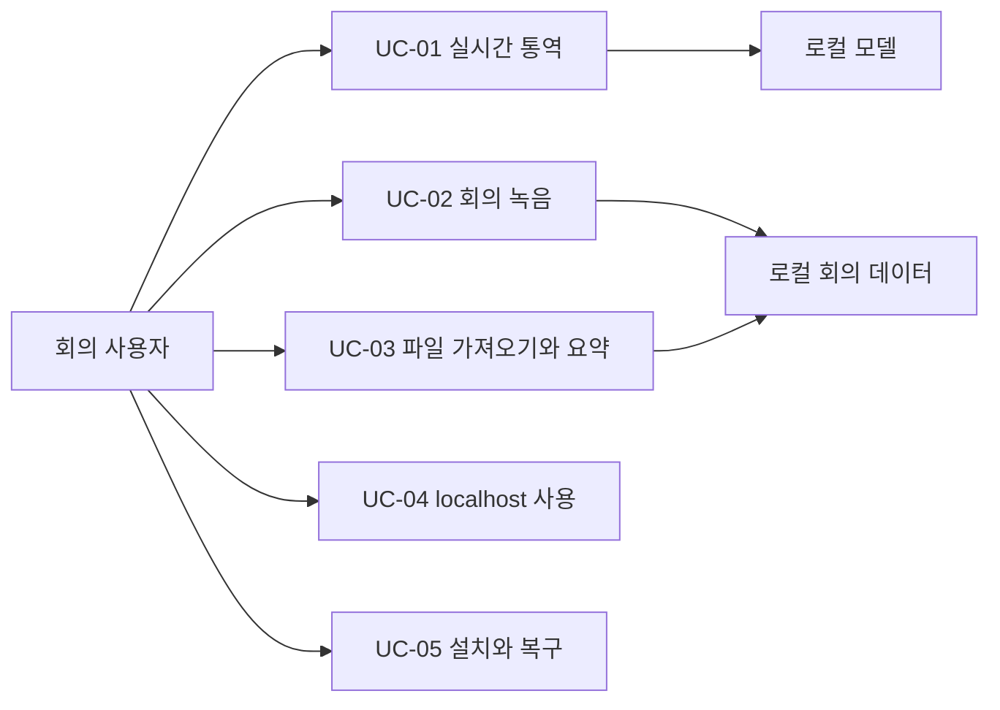

# 유스케이스 명세서

> 사용자가 수행하는 핵심 흐름과 오류·대체 경로를 정의한다.

| 항목 | 내용 |
|------|------|
| 프로젝트명 | Meetily2 |
| 문서 번호 | WF-01-02 |
| 문서 버전 | v0.2 |
| 작성일 | 2026-09-25 |
| 수정일 | 2026-09-25 |
| 작성자 | Codex (AI 문서 초안) |
| 승인자 | 미지정 (승인 기록 없음) |
| 문서 상태 | 검토 초안 (릴리스 승인 아님) |

---

## 변경 이력

| 버전 | 날짜 | 작성자 | 변경 내용 |
|------|------|--------|-----------|
| v0.1 | 2026-09-25 | Codex | Meetily2 단계별 초안 작성 |
| v0.2 | 2026-09-25 | Codex | 문서 정보·변경 이력·목차·번호 체계와 개요 보강 |

---

## 목차

1. [문서 개요](#1-문서-개요)
2. [유스케이스 관계도](#2-유스케이스-관계도)
3. [액터 정의](#3-액터-정의)
4. [유스케이스 목록](#4-유스케이스-목록)
5. [유스케이스 상세 명세](#5-유스케이스-상세-명세)
6. [예외 흐름과 종료 조건](#6-예외-흐름과-종료-조건)

---

## 1. 문서 개요

### 1.1 목적

사용자가 수행하는 핵심 흐름과 오류·대체 경로를 정의한다.

### 1.2 적용 범위와 독자

실시간 통역, 녹음, 파일 가져오기, localhost, 설치·복구를 다룬다. 제품 기획·개발·QA·릴리스 검토자가 사용한다.

### 1.3 기준과 판정

이 문서는 2026-09-25의 소스와 기록을 바탕으로 한 **검토 초안**이다. 문서화·코드 구현·실행 검증·일반 배포 승인은 서로 다른 상태다.

---

## 2. 유스케이스 관계도

---

## 3. 액터 정의

| 액터 | 역할과 경계 |
|------|--------------|
| 회의 사용자 | 모드·입력원·시작·중지·검토를 결정 |
| macOS | 네이티브 마이크·컴퓨터 소리 권한을 제공하거나 거부 |
| 브라우저 | localhost UI의 마이크·공유 권한을 별도로 결정 |
| 로컬 모델 서비스 | Whisper 전사와 Qwen 번역·요약을 수행 |

---

## 4. 유스케이스 목록

| ID | 목표 | 선행 조건 | 검증 |
|----|------|-----------|------|
| UC-01 | 진행 중 일본어→한국어 통역 | 모델·권한 | TC-01~TC-04 |
| UC-02 | 회의 녹음·전사 | 저장 공간·권한 | TC-05 |
| UC-03 | 파일 가져오기·회의록 | 지원 파일·모델 | TC-06 |
| UC-04 | 같은 Mac의 localhost 이용 | 앱·서비스 실행 | TC-07~TC-08 |
| UC-05 | 개발 후보 설치·복구 | Apple Silicon Mac | TC-10 |

---

## 5. 유스케이스 상세 명세

### 4.1 UC-01 일본어 한국어 실시간 통역

**선행:** 모델 준비, 입력원 권한 승인, 앱 실행. **주 경로:** (1) 실시간 통역 모드 선택 → (2) 마이크/컴퓨터 소리/혼합 선택 → (3) 시작 → (4) 일본어 전사와 대응 한국어를 좌우에서 확인 → (5) timeline의 이전 발화를 다시 확인 → (6) 중지. **대체 경로:** 컴퓨터 소리 시작 실패 시 명시적 오류, 모델 미준비 시 상태 표시, 번역 실패 시 원문과 실패 상태 보존. **종료:** 캡처·추론 작업 종료, 다음 시작 시 새 세션. 확인 기준: [TC-01~TC-04](../05-테스트/테스트케이스.md).

### 4.2 UC-02 회의 녹음과 전사

**선행:** 저장 공간과 권한 확인. **주 경로:** 회의 녹음 모드 선택 → 시작 → 중지 → 저장된 회의 열기 → 시간 순 전사·오디오 확인. **대체 경로:** 권한 거부, 캡처 실패, 청크 중복 전송, 저장 실패. 중복 청크는 동일한 sequence의 receipt로 멱등 응답해야 한다. 확인 기준: [TC-05](../05-테스트/테스트케이스.md).

### 4.3 UC-03 오디오 파일 가져오기와 회의록

**주 경로:** 파일 선택 → 로컬 변환/전사 → 회의 내용 검토 → 요약 요청 → 한국어 회의록 검토. 빈 전사에는 요약 오류를 반환한다. 원문 확인 없이 자동 결과를 확정하지 않는다. 확인 기준: [TC-06](../05-테스트/테스트케이스.md).

### 4.4 UC-04 localhost 사용

**선행:** 앱과 로컬 서비스 기동. **주 경로:** 같은 Mac의 `127.0.0.1:3118` 접속 → 모드 선택 → 브라우저 허용 범위 내 마이크/공유 음성 입력 → 좌우 자막 확인. 브라우저의 컴퓨터 소리 공유는 네이티브 Core Audio와 별도 기능이다. 확인 기준: [TC-07](../05-테스트/테스트케이스.md).

### 4.5 UC-05 개발 후보 설치와 복구

DMG 설치 → 첫 실행 → 모델 다운로드 → 권한 승인 → 통역/녹음 확인. 설치 실패, 서명 경고, 서비스 포트 충돌, 모델 누락은 [런북](../09-운영런북/장애대응-런북.md)에 따라 진단한다. 일반 배포 수용 기준은 [TC-10](../05-테스트/테스트케이스.md)까지 충족되어야 한다.

---

## 6. 예외 흐름과 종료 조건

모델 미준비, 권한 거부, 컴퓨터 소리 시작 실패, 빈 전사, DB 503을 정상 완료로 처리하지 않는다. 종료 시 입력 수집을 멈추고 진행 중 요청을 정리한다. 시험의 실제 통과 범위는 [결과 보고서](../05-테스트/테스트결과보고서.md)에 별도로 기록한다.
