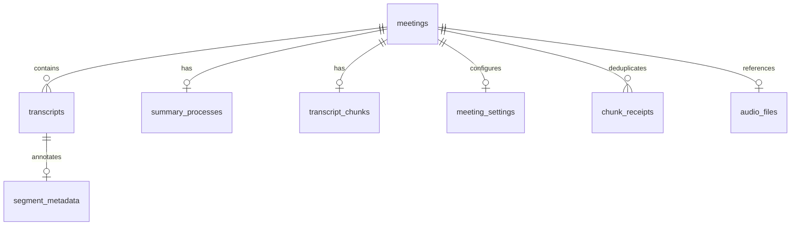

# 데이터베이스 설계서

> 회의 데이터와 sidecar 메타데이터의 저장 구조와 소유권을 설명한다.

| 항목 | 내용 |
|------|------|
| 프로젝트명 | Meetily2 |
| 문서 번호 | WF-02-03 |
| 문서 버전 | v0.2 |
| 작성일 | 2026-09-25 |
| 수정일 | 2026-09-25 |
| 작성자 | Codex (AI 문서 초안) |
| 승인자 | 미지정 (승인 기록 없음) |
| 문서 상태 | 검토 초안 (릴리스 승인 아님) |

---

## 변경 이력

| 버전 | 날짜 | 작성자 | 변경 내용 |
|------|------|--------|-----------|
| v0.1 | 2026-09-25 | Codex | Meetily2 단계별 초안 작성 |
| v0.2 | 2026-09-25 | Codex | 문서 정보·변경 이력·목차·번호 체계와 개요 보강 |

---

## 목차

1. [문서 개요](#1-문서-개요)
2. [저장 경계 개요](#2-저장-경계-개요)
3. [엔터티 관계](#3-엔터티-관계)
4. [테이블 명세](#4-테이블-명세)
5. [키와 인덱스 전략](#5-키와-인덱스-전략)
6. [데이터 보존과 보안](#6-데이터-보존과-보안)
7. [용량과 마이그레이션 검증](#7-용량과-마이그레이션-검증)
8. [구현 참조](#8-구현-참조)

---

## 1. 문서 개요

### 1.1 목적

회의 데이터와 sidecar 메타데이터의 저장 구조와 소유권을 설명한다.

### 1.2 적용 범위와 독자

Tauri 기본 SQLite 스키마, Bun sidecar, 로컬 오디오 파일을 다룬다. 제품 기획·개발·QA·릴리스 검토자가 사용한다.

### 1.3 기준과 판정

이 문서는 2026-09-25의 소스와 기록을 바탕으로 한 **검토 초안**이다. 문서화·코드 구현·실행 검증·일반 배포 승인은 서로 다른 상태다.

---

## 2. 저장 경계 개요

Tauri 앱이 기본 회의 스키마의 마이그레이션 소유자이고 Bun 서버는 별도 sidecar를 붙인다. 앱 모드에서 Bun은 기본 테이블 준비를 기다리며, 명시적 웹 단독 bootstrap 모드에서만 기본 테이블을 직접 만든다. 오디오 파일은 DB 레코드와 연결되는 로컬 파일이다.

---

## 3. 엔터티 관계

`local_meta` 테이블은 sidecar DB에 있으므로 위의 논리 관계와 SQLite 외래 키 제약은 같지 않다. 실제 외래 키는 기본 DB의 일부 테이블에만 선언되어 있다.

---

## 4. 테이블 명세

Tauri 앱 모드에서는 Rust 마이그레이션이 기본 SQLite 스키마의 소유자다. Bun 로컬 서버는 기본 테이블이 준비될 때까지 재시도하며, 별도의 `local_meta` sidecar DB를 붙인다. 명시적 웹 단독 모드(`MEETILY_BOOTSTRAP_DB=1`)에서만 Bun이 기본 스키마를 생성한다. 구현: [database.ts](../../../v2.0/meetily/frontend/local-server/database.ts).

| 저장소·테이블 | 주 키 | 주요 내용 |
| --- | --- | --- |
| 기본 `meetings` | `id` | 제목, 생성/수정 시각, 폴더 경로 |
| 기본 `transcripts` | `id` | 회의 ID, 원문, 시간, 선택적 요약·화자·오디오 구간 |
| 기본 `summary_processes` | `meeting_id` | 요약 처리 상태·결과·오류·시간·백업 |
| 기본 `transcript_chunks` | `meeting_id` | 합쳐진 전사, 모델, 청크 설정 |
| sidecar `meeting_settings` | `meeting_id` | 언어, 통역 여부 |
| sidecar `segment_metadata` | `transcript_id` | 순번, 번역, 번역 오류 |
| sidecar `chunk_receipts` | `(meeting_id, sequence)` | 중복 청크 요청의 멱등 결과 |
| sidecar `audio_files` | `meeting_id` | 로컬 오디오 파일명, MIME, SHA-256 |

기본 DB의 회의 삭제는 관련 `transcripts`·`summary_processes`·`transcript_chunks`에 cascade 외래 키가 적용된다. sidecar와 오디오 파일은 별도 저장소라 삭제·백업·마이그레이션 시 함께 다루어야 한다. DB는 WAL 모드·busy timeout을 사용한다. 실제 파일 경로는 런타임 설정에 따라 달라지므로 고정된 사용자 경로를 문서에 저장하지 않는다.

---

## 5. 키와 인덱스 전략

현재 코드에서 확인되는 키는 각 테이블의 기본 키, `chunk_receipts(meeting_id, sequence)` 복합 기본 키, `segment_metadata(meeting_id, sequence, transcript_id)` 유일 제약이다. 기본 DB는 `PRAGMA foreign_keys = ON`, `busy_timeout = 5000`, WAL을 사용한다. 추가 검색 인덱스나 대용량 성능은 실측·쿼리 계획 근거 없이 이미 최적화됐다고 표기하지 않는다.

---

## 6. 데이터 보존과 보안

백업 전에 앱과 로컬 서버를 종료하고 기본 DB·sidecar DB·오디오 디렉터리의 일관된 사본을 만든다. 사본에서 회의 목록·상세·오디오 조회와 요약 재조회를 검사한다. 원본 DB를 테스트용으로 초기화하거나 덮어쓰지 않는다. 정식 보존 기간과 사용자 데이터 삭제 UX는 별도 정책 결정이 필요하다.

개인 오디오·회의 텍스트는 공개 저장소나 공유 로그에 넣지 않는다. 자동 보존 기간·완전 삭제 UX·백업 주기는 아직 승인된 사용자 정책이 없다.

---

## 7. 용량과 마이그레이션 검증

저장 용량은 음성 길이와 WAV 크기에 비례한다. 실제 사용량 기준선은 별도 측정이 필요하다. 스키마 변경은 원본 DB가 아닌 사본에서 먼저 마이그레이션하고, 회의 목록·세그먼트·요약·오디오 조회를 비교한다.

---

## 8. 구현 참조

[database.ts](../../../v2.0/meetily/frontend/local-server/database.ts) · [API 설계](API설계서.md) · [운영 가이드](../06-배포/운영가이드.md)
