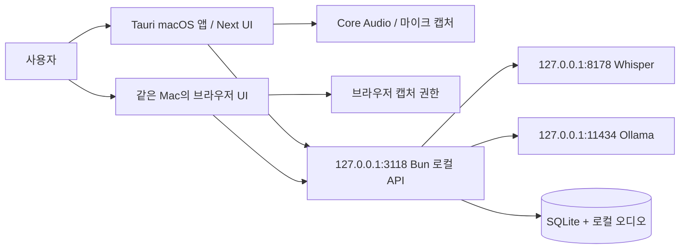

# 시스템 아키텍처 설계서 (SAD)

> 네이티브·브라우저·로컬 모델·데이터 저장소의 경계를 명확히 한다.

| 항목 | 내용 |
|------|------|
| 프로젝트명 | Meetily2 |
| 문서 번호 | WF-02-01 |
| 문서 버전 | v0.2 |
| 작성일 | 2026-09-25 |
| 수정일 | 2026-09-25 |
| 작성자 | Codex (AI 문서 초안) |
| 승인자 | 미지정 (승인 기록 없음) |
| 문서 상태 | 검토 초안 (릴리스 승인 아님) |

---

## 변경 이력

| 버전 | 날짜 | 작성자 | 변경 내용 |
|------|------|--------|-----------|
| v0.1 | 2026-09-25 | Codex | Meetily2 단계별 초안 작성 |
| v0.2 | 2026-09-25 | Codex | 문서 정보·변경 이력·목차·번호 체계와 개요 보강 |

---

## 목차

1. [문서 개요](#1-문서-개요)
2. [아키텍처 개요](#2-아키텍처-개요)
3. [기술 스택과 역할](#3-기술-스택과-역할)
4. [배포 아키텍처](#4-배포-아키텍처)
5. [아키텍처 결정 기록](#5-아키텍처-결정-기록)
6. [비기능 요구사항 대응](#6-비기능-요구사항-대응)
7. [관련 문서](#7-관련-문서)

---

## 1. 문서 개요

### 1.1 목적

네이티브·브라우저·로컬 모델·데이터 저장소의 경계를 명확히 한다.

### 1.2 적용 범위와 독자

Apple Silicon macOS 앱, 같은 Mac의 localhost와 로컬 추론 서비스를 포함한다. 제품 기획·개발·QA·릴리스 검토자가 사용한다.

### 1.3 기준과 판정

이 문서는 2026-09-25의 소스와 기록을 바탕으로 한 **검토 초안**이다. 문서화·코드 구현·실행 검증·일반 배포 승인은 서로 다른 상태다.

---

## 2. 아키텍처 개요

네이티브 앱은 Tauri/Rust가 오디오 장치·권한·로컬 서비스 생명주기를 맡고 Next.js UI가 모드·자막·회의 화면을 제공한다. Bun API는 전사·번역·요약 요청과 회의 데이터를 연결한다. 현재 기본 모델은 Whisper large-v3-turbo(전사)와 `qwen3.5:4b`(번역·요약)다. localhost 브라우저는 같은 UI·API를 사용하지만 캡처 경로가 다르다. 인터넷은 빌드와 최초 모델 다운로드 등에 필요할 수 있으며, 서비스 추론은 로컬 모델 경로로 설계되어 있다.

실시간 통역: 선택한 음성원 → PCM 프레임 → 발화 청크 → Whisper 일본어 전사 → 최근 두 완료 발화 문맥을 포함한 Ollama 한국어 번역 → 좌우 자막과 순서가 유지된 timeline. 오래 걸리는 번역 중에도 이전 결과를 잃지 않도록 원문·번역 상태를 분리한다.

회의 작업: 녹음/가져오기 → 청크 전사 → SQLite `meetings`/`transcripts` 및 sidecar metadata → 한국어 요약 → `summary_processes`. 녹음 데이터와 모델은 저장소에 올리지 않는다.

---

## 3. 기술 스택과 역할

| 구성 | 기술과 역할 | 소스 기준 |
|------|---------------|-----------|
| macOS 앱 | Tauri/Rust, Core Audio 입력과 프로세스 기동 | `src-tauri/src/` |
| 화면 | Next.js/React, 모드·통역·회의 화면 | `src/local/` |
| 로컬 API | Bun HTTP, 회의 저장·전사·번역·요약 요청 | `local-server/` |
| 전사 | Whisper large-v3-turbo, 기본 로컬 서버 8178 | 앱 설정·README |
| 번역/요약 | Ollama `qwen3.5:4b`, 기본 로컬 서버 11434 | 앱 설정·README |
| 저장 | SQLite 기본 DB·sidecar·로컬 WAV | `local-server/database.ts` |

---

## 4. 배포 아키텍처

DMG에는 앱과 필요한 실행 구성요소를 패키징하고 모델은 첫 실행 흐름에서 내려받는다. 로컬 API는 `127.0.0.1:3118`에 바인딩한다. 개발 후보의 ad-hoc 서명은 일반 배포 서명·공증을 대신하지 않는다. 브라우저 사용은 앱과 서비스가 켜진 **같은 Mac**으로 제한한다. [배포 계획](../06-배포/배포계획서.md)을 따른다.

---

## 5. 아키텍처 결정 기록

| ID | 결정 | 이유와 제약 |
|----|------|-------------|
| ADR-01 | 통역과 회의 저장 흐름 분리 | 실시간 자막을 자동 녹음으로 오해하지 않게 함 |
| ADR-02 | 네이티브·브라우저 캡처 별도 경로 | Core Audio 권한과 브라우저 공유 권한이 다름 |
| ADR-03 | 로컬 추론·loopback API | 같은 Mac에서 전사·번역·요약 처리; 첫 모델 다운로드에는 인터넷 필요 |
| ADR-04 | 기본 DB와 sidecar DB 분리 | Tauri 마이그레이션 소유권을 지키며 로컬 메타데이터 확장 |

---

## 6. 비기능 요구사항 대응

- API는 loopback(`127.0.0.1`)에 바인딩한다. 변경 요청에는 로컬 origin/client 헤더 검사를 적용한다. 상세 계약은 [API 설계](API설계서.md).
- 컴퓨터 소리 요청 실패는 오류로 보고해야 한다. 마이크 단독으로 조용히 전환하면 사용자에게 잘못된 완전성을 암시한다.
- 모델 미기동, DB 마이그레이션 지연, 포트 충돌, 권한 거부는 서로 다른 오류로 진단한다. DB 준비 전 API는 503을 줄 수 있다.
- 오디오·모델 추론 지연과 ASR 환각 가능성이 있으므로 UI는 완료/처리 중/오류를 구분한다. 관찰된 릴리스 위험은 [테스트 결과](../05-테스트/테스트결과보고서.md)를 따른다.

구현 근거: [로컬 서버](../../../v2.0/meetily/frontend/local-server/index.ts), [요청 보안](../../../v2.0/meetily/frontend/local-server/security.ts), [네이티브 PCM 경로](../../../v2.0/meetily/frontend/src/local/native/tauriPcmCapture.ts).

| NFR | 설계 대응 | 아직 필요한 증거 |
|-----|-----------|------------------|
| NFR-01 | loopback 바인딩·Host/Origin 검사 | 다른 인터페이스 노출 재확인 |
| NFR-02 | 순서 보존 큐·짧은 청크 | 조건별 p50/p95와 정확도 측정 |
| NFR-03 | 세션 종료·큐 정리 | 30~60분 RSS·압력·누락 기록 |
| NFR-04 | DMG 빌드·서명 경로 분리 | 공증·clean-Mac 설치 |

---

## 7. 관련 문서

[API 설계](API설계서.md) · [DB 설계](데이터베이스설계서.md) · [상세 설계](../03-상세설계/상세설계서.md) · [테스트 결과](../05-테스트/테스트결과보고서.md)
