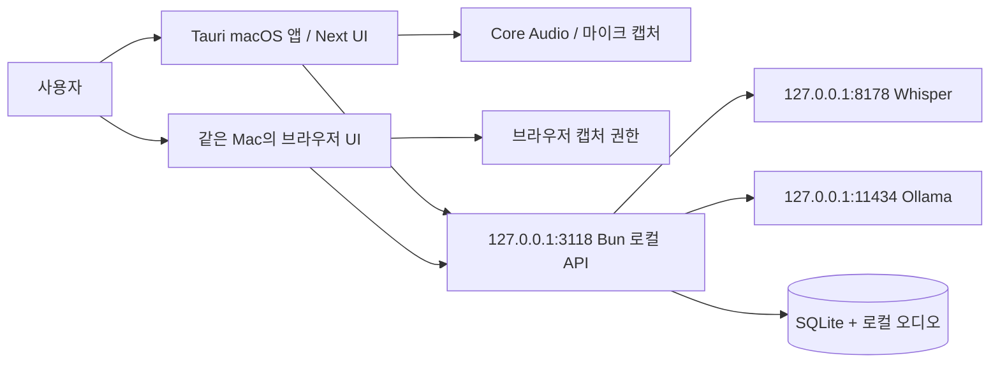

# 시스템 아키텍처 설계서 (SAD)

## 실행 경계

네이티브 앱은 Tauri/Rust가 오디오 장치·권한·로컬 서비스 생명주기를 맡고 Next.js UI가 모드·자막·회의 화면을 제공한다. Bun API는 전사·번역·요약 요청과 회의 데이터를 연결한다. 현재 기본 모델은 Whisper large-v3-turbo(전사)와 `qwen3.5:4b`(번역·요약)다. localhost 브라우저는 같은 UI·API를 사용하지만 캡처 경로가 다르다. 인터넷은 빌드와 최초 모델 다운로드 등에 필요할 수 있으며, 서비스 추론은 로컬 모델 경로로 설계되어 있다.

## 프로세스와 데이터 흐름

실시간 통역: 선택한 음성원 → PCM 프레임 → 발화 청크 → Whisper 일본어 전사 → 최근 두 완료 발화 문맥을 포함한 Ollama 한국어 번역 → 좌우 자막과 순서가 유지된 timeline. 오래 걸리는 번역 중에도 이전 결과를 잃지 않도록 원문·번역 상태를 분리한다.

회의 작업: 녹음/가져오기 → 청크 전사 → SQLite `meetings`/`transcripts` 및 sidecar metadata → 한국어 요약 → `summary_processes`. 녹음 데이터와 모델은 저장소에 올리지 않는다.

## 신뢰·장애 경계

- API는 loopback(`127.0.0.1`)에 바인딩한다. 변경 요청에는 로컬 origin/client 헤더 검사를 적용한다. 상세 계약은 [API 설계](API설계서.md).
- 컴퓨터 소리 요청 실패는 오류로 보고해야 한다. 마이크 단독으로 조용히 전환하면 사용자에게 잘못된 완전성을 암시한다.
- 모델 미기동, DB 마이그레이션 지연, 포트 충돌, 권한 거부는 서로 다른 오류로 진단한다. DB 준비 전 API는 503을 줄 수 있다.
- 오디오·모델 추론 지연과 ASR 환각 가능성이 있으므로 UI는 완료/처리 중/오류를 구분한다. 관찰된 릴리스 위험은 [테스트 결과](../05-테스트/테스트결과보고서.md)를 따른다.

구현 근거: [로컬 서버](../../../v2.0/meetily/frontend/local-server/index.ts), [요청 보안](../../../v2.0/meetily/frontend/local-server/security.ts), [네이티브 PCM 경로](../../../v2.0/meetily/frontend/src/local/native/tauriPcmCapture.ts).
