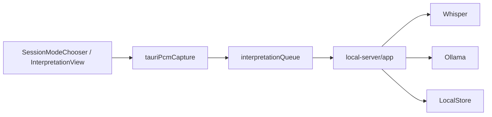
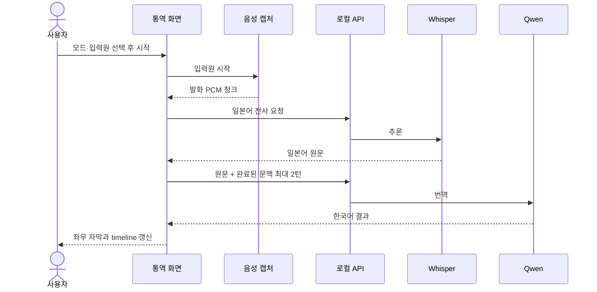

# 상세 설계서

> 음성 청크부터 전사·번역·저장까지의 처리 규칙과 실패 경로를 정리한다.

| 항목 | 내용 |
|------|------|
| 프로젝트명 | Meetily2 |
| 문서 번호 | WF-03-01 |
| 문서 버전 | v0.2 |
| 작성일 | 2026-09-25 |
| 수정일 | 2026-09-25 |
| 작성자 | Codex (AI 문서 초안) |
| 승인자 | 미지정 (승인 기록 없음) |
| 문서 상태 | 검토 초안 (릴리스 승인 아님) |

---

## 변경 이력

| 버전 | 날짜 | 작성자 | 변경 내용 |
|------|------|--------|-----------|
| v0.1 | 2026-09-25 | Codex | Meetily2 단계별 초안 작성 |
| v0.2 | 2026-09-25 | Codex | 문서 정보·변경 이력·목차·번호 체계와 개요 보강 |

---

## 목차

1. [문서 개요](#1-문서-개요)
2. [모듈 책임도](#2-모듈-책임도)
3. [실시간 통역 시퀀스](#3-실시간-통역-시퀀스)
4. [세션과 발화 상태](#4-세션과-발화-상태)
5. [모듈 상세 설계](#5-모듈-상세-설계)
6. [적용한 설계 패턴](#6-적용한-설계-패턴)
7. [구현 규칙과 검증](#7-구현-규칙과-검증)
8. [관련 문서](#8-관련-문서)

---

## 1. 문서 개요

### 1.1 목적

음성 청크부터 전사·번역·저장까지의 처리 규칙과 실패 경로를 정리한다.

### 1.2 적용 범위와 독자

네이티브 실시간 통역과 로컬 회의 저장·요약 경로를 다룬다. 제품 기획·개발·QA·릴리스 검토자가 사용한다.

### 1.3 기준과 판정

이 문서는 2026-09-25의 소스와 기록을 바탕으로 한 **검토 초안**이다. 문서화·코드 구현·실행 검증·일반 배포 승인은 서로 다른 상태다.

---

## 2. 모듈 책임도

이 그림은 책임 관계의 요약이다. 브라우저 캡처와 회의 녹음은 네이티브 실시간 캡처와 다른 진입점을 사용한다.

---

## 3. 실시간 통역 시퀀스

번역 지연과 재시도 중에도 앞선 완료 발화가 timeline에 남아야 한다.

---

## 4. 세션과 발화 상태

세션의 사용자 가시 상태는 대기→시작 중→입력/전사/번역 중→중지 중→종료 또는 오류로 구분한다. 각 발화는 원문 대기, 번역 대기, 완료, 번역 오류를 별도로 표시한다. 원문이 수정되면 이전 번역을 무효화한다. 실제 내부 enum과 UI 상태의 대응은 구현 변경 시 회귀 검사한다.

---

## 5. 모듈 상세 설계

### 5.1 실시간 통역

1. 사용자가 통역 모드·입력원을 고르고 시작할 때만 캡처를 연다. 네이티브 입력은 [Rust 캡처](../../../v2.0/meetily/frontend/src-tauri/src/audio/)에서 PCM으로 오고, [tauriPcmCapture.ts](../../../v2.0/meetily/frontend/src/local/native/tauriPcmCapture.ts)가 UI의 발화 분할 경로로 전달한다.
2. 발화 청크마다 일본어 전사를 요청한다. 요청 순서와 발화 sequence를 유지하며, 늦게 끝난 요청이 최신 화면을 덮지 않도록 세션별 결과를 연결한다.
3. 확정된 일본어와 최근 **완료된** 원문/번역 최대 두 턴을 번역 입력으로 보낸다. 아직 완료되지 않은 번역을 문맥으로 사용하지 않는다. 원문이 수정되면 이전 번역은 무효화하고 같은 원문의 새 결과만 연결한다. 구현: [interpretationQueue.ts](../../../v2.0/meetily/frontend/src/local/native/interpretationQueue.ts).
4. timeline은 발화별 카드로 보존한다. 현재 자막 표시와 이력 탐색을 분리하여 새 발화가 들어와도 과거 카드가 남는다. 화면 상태: [InterpretationView.tsx](../../../v2.0/meetily/frontend/src/local/components/InterpretationView.tsx).
5. 중지·컴포넌트 해제 시 오디오 캡처와 미완료 요청을 종료하고, 다음 시작은 새 세션으로 취급한다. 캡처 실패·모델 오류·번역 오류는 사용자에게 표시한다.

이 처리 방식은 **단기 문맥**과 순서 무결성을 높이려는 설계다. 일본어 ASR의 구두점·고유명사·혼합 오디오 분리, 통역 톤앤매너의 실제 정확도는 자동으로 해결되지 않는다. [품질 평가](../../../v2.0/docs/interpretation-quality.md)에 따라 원음 대조 샘플과 오류 유형을 측정해야 한다.

### 5.2 회의 녹음과 가져오기

회의 생성 후 각 청크는 `(meeting_id, sequence)`로 멱등화한다. 전사와 번역 메타데이터는 별도 테이블에 저장하고, 원음은 로컬 파일에 연결한다. 가져오기는 파일 변환→전사→회의 생성/저장 순서다. 요약은 저장된 세그먼트를 모아 모델에 요청하며, 빈 전사에는 409를 반환한다. 구현: [app.ts](../../../v2.0/meetily/frontend/local-server/app.ts), [database.ts](../../../v2.0/meetily/frontend/local-server/database.ts).

### 5.3 자원과 오류

로컬 서버는 전사·번역 추론 큐와 본문 크기 제한을 둔다. 음성 스트림, 모델, SQLite는 한 Mac에서 함께 자원을 쓰므로 실오디오 30~60분 동안 프로세스별 RSS/메모리 압력·누적 timeline·대기 큐·자막 지연을 기록해야 한다. 검증 전에는 메모리 최적화 완료 또는 지연 수치를 약속하지 않는다.

---

## 6. 적용한 설계 패턴

| 패턴 | 사용 위치 | 목적 |
|------|-----------|------|
| 발화별 순서 보존 | `interpretationQueue.ts` | 비동기 전사·번역이 카드 순서를 바꾸지 않음 |
| 유한 문맥 | 완료된 최근 2턴 | 토큰·메모리 증가를 제한하면서 용어를 이어감 |
| 멱등 청크 receipt | `database.ts` | 동일 sequence 재전송 시 중복 저장 방지 |
| DB 소유권 분리 | Tauri 기본 스키마 / Bun sidecar | 앱 마이그레이션과 로컬 확장 충돌 방지 |

---

## 7. 구현 규칙과 검증

청크·번역·요약 오류를 성공 상태로 합치지 않는다. 세션 종료 후 늦게 도착한 응답이 새 세션을 덮어쓰지 않도록 검증한다. 긴 세션의 메모리·큐·지연은 아직 미측정이므로 성능 완료라고 표기하지 않는다. 관련 [TC-02~TC-09](../05-테스트/테스트케이스.md)를 사용한다.

---

## 8. 관련 문서

[아키텍처](../02-시스템설계/시스템아키텍처설계서-SAD.md) · [API](../02-시스템설계/API설계서.md) · [DB](../02-시스템설계/데이터베이스설계서.md) · [통역 품질](../../../v2.0/docs/interpretation-quality.md)
