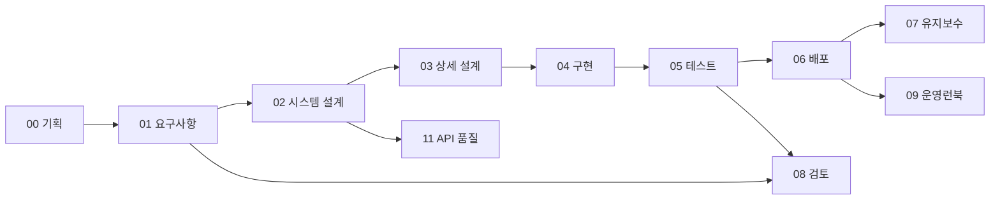

# Meetily2 waterfall 문서

> 단계별 문서의 위치, 인계 조건과 근거 상태를 한 곳에서 찾도록 한다.

| 항목 | 내용 |
|------|------|
| 프로젝트명 | Meetily2 |
| 문서 번호 | WF-INDEX |
| 문서 버전 | v0.2 |
| 작성일 | 2026-09-25 |
| 수정일 | 2026-09-25 |
| 작성자 | Codex (AI 문서 초안) |
| 승인자 | 미지정 (승인 기록 없음) |
| 문서 상태 | 검토 초안 (릴리스 승인 아님) |

---

## 변경 이력

| 버전 | 날짜 | 작성자 | 변경 내용 |
|------|------|--------|-----------|
| v0.1 | 2026-09-25 | Codex | Meetily2 단계별 초안 작성 |
| v0.2 | 2026-09-25 | Codex | 문서 정보·변경 이력·목차·번호 체계와 개요 보강 |

---

## 목차

1. [문서 개요](#1-문서-개요)
2. [문서 구조와 단계별 인계](#2-문서-구조와-단계별-인계)
3. [문서 의존성](#3-문서-의존성)
4. [빠른 시작](#4-빠른-시작)
5. [문서 작성 규칙](#5-문서-작성-규칙)
6. [문서 검색과 갱신](#6-문서-검색과-갱신)
7. [문서 관리](#7-문서-관리)

---

## 1. 문서 개요

### 1.1 목적

단계별 문서의 위치, 인계 조건과 근거 상태를 한 곳에서 찾도록 한다.

### 1.2 적용 범위와 독자

기획부터 운영·품질까지의 Meetily2 문서와 릴리스 상태를 연결한다. 제품 기획·개발·QA·릴리스 검토자가 사용한다.

### 1.3 기준과 판정

이 문서는 2026-09-25의 소스와 기록을 바탕으로 한 **검토 초안**이다. 문서화·코드 구현·실행 검증·일반 배포 승인은 서로 다른 상태다.

2026-09-25 현재 소스와 릴리스 기록을 기준으로 작성한 단계별 산출물이다. [VIVE CRM의 단계별 문서 구조](https://github.com/younghai/vive-md/tree/e8f843770a884f252f1c646fa757efc1425b6399/crm/docs)를 형식 참고자료로 사용했으며, 내용과 완료 판정은 Meetily2에 맞춰 새로 작성했다.

**상태:** 설계·구현 기록을 정리한 작업 문서. 고객 승인, 완전한 E2E 검증 또는 일반 배포 승인을 뜻하지 않는다. 기능의 실제 근거는 [소스 README](../../README.md), [3회 점검 상태](../../reviews/STATE.md), [RC6 릴리스 노트](../../v2.0/docs/release-2.0.2-rc.6.md)를 우선한다.

---

## 2. 문서 구조와 단계별 인계

| 단계 | 산출물 | 다음 단계로 넘길 조건 |
| --- | --- | --- |
| 00 기획 | [서비스 기획](00-기획/서비스기획서.md), [제품 정책](00-기획/비즈니스정책서.md) | 대상 사용자·모드·비목표 합의 |
| 01 요구사항 | [SRS](01-요구사항분석/요구사항명세서-SRS.md), [유스케이스](01-요구사항분석/유스케이스명세서.md), [RTM](01-요구사항분석/요구사항추적매트릭스-RTM.md) | 요구사항과 검증 기준 연결 |
| 02 시스템 설계 | [아키텍처](02-시스템설계/시스템아키텍처설계서-SAD.md), [API](02-시스템설계/API설계서.md), [DB](02-시스템설계/데이터베이스설계서.md), [화면](02-시스템설계/화면설계서.md) | 경계·데이터·화면 계약 확인 |
| 03 상세 설계 | [통역·저장 처리](03-상세설계/상세설계서.md) | 오류·순서·종료 경로 정의 |
| 04 구현 | [구현 가이드](04-구현/구현가이드.md) | 소스·빌드·검증 방법 재현 가능 |
| 05 테스트 | [계획](05-테스트/테스트계획서.md), [케이스](05-테스트/테스트케이스.md), [결과](05-테스트/테스트결과보고서.md) | 차단 결함 없이 증거 확보 |
| 06 배포 | [배포 계획](06-배포/배포계획서.md), [운영 가이드](06-배포/운영가이드.md) | 서명·공증·별도 Mac 검증 통과 |
| 07 유지보수 | [유지보수 계획](07-유지보수/유지보수계획서.md) | 회귀·데이터·릴리스 절차 유지 |
| 08 검토 | [단계별 체크리스트](08-검토/단계별검토-체크리스트.md), [우선순위](08-검토/우선순위-로드맵.md) | 미해결 항목의 책임·증거 기록 |
| 09 운영 | [장애 대응 런북](09-운영런북/장애대응-런북.md) | 진단·복구 절차 재현 |
| 11 품질 | [로컬 API 계약 정책](11-품질/API-계약-운영정책.md) | 계약 변경과 회귀 연결 |

---

## 3. 문서 의존성

[RTM](01-요구사항분석/요구사항추적매트릭스-RTM.md)은 단계 사이의 요구사항·시험 ID 연결이다.

---

## 4. 빠른 시작

새 작업은 [서비스 기획](00-기획/서비스기획서.md)과 [SRS](01-요구사항분석/요구사항명세서-SRS.md)에서 범위를 확인한 뒤 [RTM](01-요구사항분석/요구사항추적매트릭스-RTM.md)의 소스·TC를 찾는다. 현재 사용자 설치는 [저장소 README](../../README.md), 개발 후보의 한계는 [RC6 노트](../../v2.0/docs/release-2.0.2-rc.6.md)를 읽는다.

---

## 5. 문서 작성 규칙

각 산출물은 제목, 문서 정보, 변경 이력, 번호가 붙은 목차, `1. 문서 개요`, 문서 유형에 맞는 본문 장을 가진다. 요구사항·정책·유스케이스·테스트 ID는 문서 사이에 연결한다. `구현`, `실행 검증`, `일반 배포 승인`을 별도로 기록하고, 미실행 결과를 통과로 쓰지 않는다.

---

## 6. 문서 검색과 갱신

제품 행위는 BP 정책·SRS, 구현 위치는 RTM·설계, 실행 명령은 구현 가이드, 실제 합격 증거는 테스트 결과, 출고 여부는 배포 계획·[릴리스 상태](../../reviews/STATE.md)에서 찾는다. 새 후보가 나오면 먼저 후보 증거를 확인하고 관련 문서를 함께 갱신한다.

---

## 7. 문서 관리

단계는 문서 탐색을 위한 순서다. 이미 구현된 기능을 과거 시점의 승인 산출물처럼 소급 표기하지 않는다. 요구사항 ID와 테스트 ID는 [RTM](01-요구사항분석/요구사항추적매트릭스-RTM.md)에서 연결한다. 새 릴리스 후보가 나오면 먼저 실제 테스트 증거를 갱신하고 이 문서의 상태를 재판정한다.

작성자는 AI 초안으로 표기했고 승인자는 아직 지정되지 않았다. [원본 VIVE CRM 문서](https://github.com/younghai/vive-md/tree/e8f843770a884f252f1c646fa757efc1425b6399/crm/docs)의 **문서 틀과 추적 방식**을 참고했으며 Meetily2의 제품 내용과 승인 판정은 독립적으로 작성했다.
